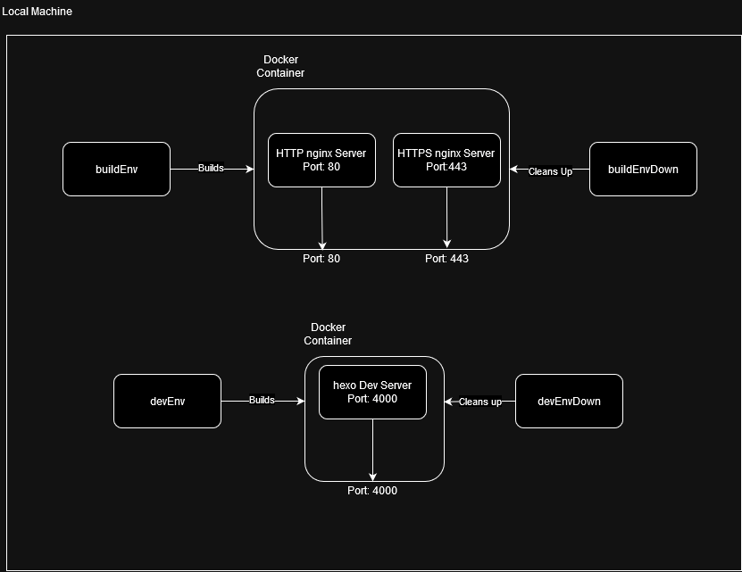

# Local Docker Development Server for v2.vuejs.org

This project has been forked from github.com/vuejs/v2.vuejs.org at 2024-09-06. Its .git file has not been altered, except for my own commits added to it. I own nothing but my own commits.


## Introduction

This is a quick project to create a basic setup for local docker development environment. Using scripts at the /_scripts folder, you can start a local development environment using only docker, docker-compose and openssl(not required for devEnv script).



## Requirements

- Docker
- docker-compose standalone client*
- openssl

*Please note that older versions might not work, if you face docker-based issues, update your both docker and docker-compose to newer version.
## Usage Guide 

### Quick Usage

- Install docker, docker-compose and openssl on your local machine.
- In ./_scripts folder, run 'sudo bash {script_name}'. If you want a dev server without nginx and https, run devEnv script. If you want a server that is built and running on https, run buildEnv script.
- It will automatically start a docker container.
- To clean up, run 'sudo bash {down_script_name}'

Example Usage:
```

# Always run scripts in ./_scripts directory
cd ./_scripts

# Run dev env
sudo bash devEnv
sudo bash devEnvDown

# Run nginx build env
sudo bash buildEnv
sudo bash buildEnvDown
```

## Details

- In your machine, unless you configured for it, all commands will require 'sudo' or right priviliges.
- To use any script, you can use "bash {script_name}" in _scripts file. If you run scripts in other directories like "bash /_scripts/{script_name}" you will face issues.
- For the documentation regarding how the scripts work, see the source files for comments.
### devEnv and devEnvDown Scripts

`devEnv` script is a script that creates an isolated dev environment via 'npm run dev', it will serve on CONTAINER_IP_ADDRESS:4000. It will build and serve faster than build script.

`devEnvDown` script is the script that does take down anything related to devEnv script *except for old dangling images*. If you want to clear dangling images as well, uncomment last line in the script.


### buildEnv and buildEnvDown Scripts

`buildEnv` script is a script that creates an isolated dev server environment that serves on nginx,
- It will serve on CONTAINER_IP_ADDRESS:4000.
- First it builds in a builder container, then the built pages will be copied into a nginx container and old container will stop working. We will only keep server container for this job.

`buildEnvDown` script is the script that does take down anything related to buildEnv script *except for old dangling images*. If you want to clear dangling images as well, uncomment last line in the script.


